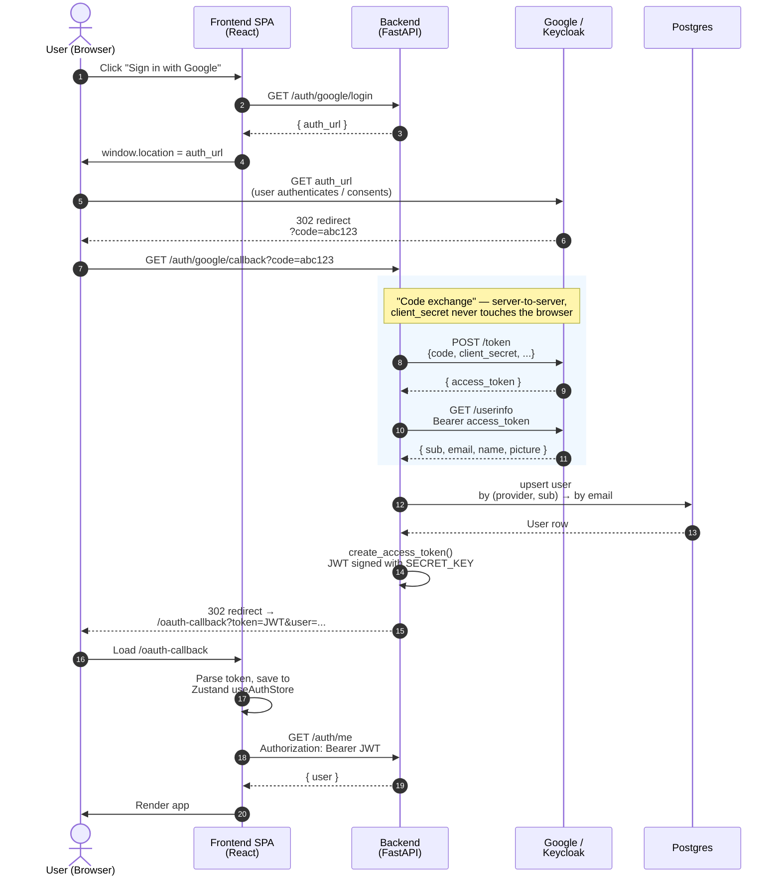
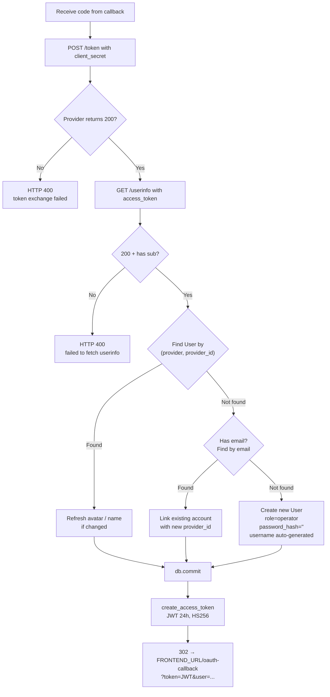

# Architecture

## Components

```
┌──────────────┐       ┌──────────────┐       ┌────────────────────┐
│   Browser    │──────▶│   Frontend   │──────▶│      Backend       │
│   (React)    │       │   (Nginx)    │       │     (FastAPI)      │
└──────────────┘       └──────────────┘       └────────┬───────────┘
                          static SPA           proxy        │   JWT
                          /api → backend                    │   bcrypt
                                                            │   Fernet
                                              ┌─────────────┼────────────┐
                                              ▼             ▼            ▼
                                       ┌──────────┐  ┌────────────┐  ┌─────────┐
                                       │ Postgres │  │ BNGBlaster │  │  SSH    │
                                       │  users   │  │ controller │  │ (VLAN   │
                                       │  configs │  │  REST API  │  │  setup) │
                                       │  servers │  │  :8080     │  │         │
                                       └──────────┘  └────────────┘  └─────────┘
```

A single FastAPI process serves six routers under `/api/v1`:

| Router | Endpoints | Purpose |
|---|---|---|
| `auth` | `/auth/login`, `/auth/me`, `/auth/users`, `/auth/providers` | Local username/password + user CRUD |
| `sso` | `/auth/{google\|keycloak}/login`, `/callback` | OIDC sign-in flows |
| `bngblaster` | `/bngblaster/*` (servers, configs, instance proxy, VLAN setup) | Core feature surface |
| `settings` | `/settings` | Per-user BNG overrides (bngblaster_url, ssh creds) |
| `metrics` | `/metrics/pageview`, `/dashboard/stats` | Page-view tracking + Dashboard aggregates (role-aware) |
| `admin_settings` | `/admin/settings/git*` | Admin-only global settings + GitHub backup of all saved configs |

## Request flow — start a test instance

1. User clicks **Run** on a saved config.
2. Browser → `POST /api/v1/bngblaster/servers/{sid}/instances/{name}/_start` with `{ config_json }`.
3. Backend extracts VLAN subinterfaces from `config_json`, opens SSH to the BNG host, runs `ip link add ... type vlan id ...` (with sudo if non-root user).
4. Backend `PUT`s the config to `http://{server.host}:{server.port}/api/v1/instances/{name}` to create/update on the BNGBlaster controller.
5. Backend `POST`s to `/_start` on the controller.
6. Frontend polls `/instances/{name}` for status; downloads `run.log` and `run_report.json` once finished.

## Data model

Tables under `backend/app/models/`:

- **users** — local + SSO accounts (`auth_provider` ∈ `local | google | keycloak`), `role` ∈ `admin | operator | viewer`, bcrypt hash for local accounts (empty for SSO).
- **bng_servers** — controller endpoints `(host, port)` plus Fernet-encrypted SSH credentials for VLAN setup; managed by admins only.
- **bng_configs** — saved test configurations (`config_json` JSONB), owned by `user_id`. Config `name` is globally unique (enforced in application code — `POST`/`PUT` return **409 Conflict** on collision; the frontend pre-checks reactively and disables Save).
- **app_settings** — per-user overrides for default BNG URL and SSH credentials. Note: `bng_ssh_pass` is stored **plaintext** (legacy) and is not currently consumed by the SSH flow — see `CLAUDE.md` for details.
- **global_settings** — single-row (id=1) table holding Git backup configuration: `git_repo_url`, `git_branch`, `git_token_enc` (Fernet-encrypted PAT), `updated_at`, `updated_by`.
- **page_views** — `(user_id, path, viewed_at)` append-only log used by the Dashboard tab.

## Auth

- **JWT** — HS256, 24h expiry, `Authorization: Bearer <token>` on every API request.
- **Local password** — bcrypt via the `bcrypt` library.
- **SSO** — OIDC code flow → backend exchanges code for userinfo → upserts user (lookup by `(provider, provider_id)` then by email) → issues JWT → 302 to `FRONTEND_URL/oauth-callback?token=...&user=...`.
- **SSH password storage** — Fernet-encrypted (when `FERNET_KEY` is set), plaintext fallback for compat.
- **GitHub PAT storage** — `global_settings.git_token_enc` uses the same Fernet helper; the API never returns the plaintext token (`GET /admin/settings/git` only exposes `git_token_set: bool`).

### SSO — OAuth2 Authorization Code Flow

End-to-end sequence (same for Google and Keycloak, only endpoints differ):



User-lookup / provisioning logic inside `_upsert_sso_user`:



Code mapping:

| Step | File : line |
|---|---|
| `GET /auth/{provider}/login` → `auth_url` | `backend/app/api/v1/sso.py:119` (Google), `:182` (Keycloak) |
| `/callback?code=...` handler | `sso.py:134` (Google), `:196` (Keycloak) |
| `POST /token` — code exchange | `sso.py:141` (Google), `:202` (Keycloak) |
| `GET /userinfo` — identity fetch | `sso.py:156` (Google), `:216` (Keycloak) |
| Upsert: `(provider, provider_id)` → email → create | `sso.py:44-95` |
| `create_access_token` (HS256 JWT) | `backend/app/core/security.py:30` |
| `302` → `/oauth-callback` | `sso.py:98-109` |
| Frontend bootstrap from token | `frontend/src/components/OAuthCallback.tsx` |

## No background jobs

Unlike the parent framework, this app has **no Celery, no Redis, no WebSocket**. All BNGBlaster operations are short-lived `httpx.AsyncClient` proxies that complete inside a single HTTP request. SSH calls run in a thread executor so they don't block the event loop.

## Frontend

Single-page React 19 app. **Five routes total**: `/login`, `/oauth-callback`, `/` (BNG console with Dashboard · Servers · Configs · Run · Reports tabs), `/admin/users`, `/admin/settings`. State lives in one Zustand store (`useAuthStore` for JWT + user); the BNG page owns its own component state. API access goes through one Axios instance with a JWT request interceptor and a 401 → logout response interceptor.

### Git backup flow

1. Admin opens `/admin/settings`, saves `git_repo_url` + PAT.
2. Frontend calls `POST /admin/settings/git/test` → backend hits `GET /user` and `GET /repos/{owner}/{repo}` on GitHub API to confirm push permission.
3. Admin clicks **Backup now** → `POST /admin/settings/git/backup` iterates every `bng_configs` row and issues `PUT /repos/{owner}/{repo}/contents/{path}` (base64 content, sha-based update) for two files per config:
   - `configs/{owner_username}/{safe_name}.json` — raw `config_json` (directly consumable by the BNGBlaster CLI).
   - `configs/{owner_username}/{safe_name}.meta.json` — sidecar with name, description, owner, timestamps.
4. Response aggregates `{created, updated, unchanged, failed}` counts with per-config details.

No `git` binary is required — everything goes through the GitHub REST API via `httpx`.

### Nginx (frontend container runtime)

The frontend is **built** with Vite (stage 1 of `frontend/Dockerfile` — `node:20-alpine`), and **served** by Nginx (stage 2 — `nginx:1.27-alpine`). The final image contains only static assets + Nginx; no Node, no source. Three jobs handled by `frontend/nginx.conf`:

1. **Serve the SPA** — `/usr/share/nginx/html` with a `try_files $uri $uri/ /index.html` fallback so client-side routes (e.g. `/admin/settings`, `/oauth-callback`) don't 404 on F5.
2. **Reverse-proxy `/api/`** → `http://backend:8000`. The `backend` hostname is resolved on every request cycle via Docker's embedded DNS (`resolver 127.0.0.11 valid=10s;`), which lets the backend container be rebuilt and get a new IP without reloading Nginx. `proxy_read_timeout 300s` covers long-running SSH/controller proxy calls.
3. **Expose Swagger** — `/docs` and `/openapi.json` are proxied through the same `3001` host port for convenience.

The setup is intentionally **same-origin**: the browser always talks to `http://host:3001`, so there is no CORS preflight and the JWT + cookies flow through as-is. Adding a TLS reverse proxy in front of the stack only needs to forward to `frontend:80` — no extra CORS config.

Dev mode (`npm run dev`) bypasses Nginx entirely: Vite's dev server listens on `:3001` and uses its built-in HTTP proxy (`vite.config.ts`) to forward `/api` to `:8001` for HMR.
